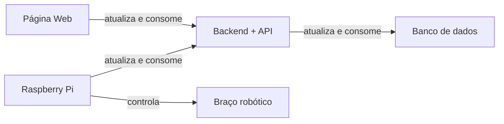

# Arquitetura do sistema

A arquitetura de sistema é um modelo que descreve a estrutura e a organização de um sistema, incluindo os componentes, suas interações e a troca de informações entre eles. A arquitetura deve ser capaz de atender aos requisitos funcionais e não funcionais do sistema, sendo escalável e capaz de se adaptar a mudanças futuras.

A solução proposta utiliza de um braço mecâncio para automatizar a montagem dos kits utilizados em um hospital. Ela visa reduzir o tempo de montagem e melhorar a eficiência na rotina de montagem dos kits, permitindo modificações nos layouts e integrações com outras soluções.

Baseando nos requisitos levantados, a solução terá 5 principais partes, que se integram com o objetivo de entregar a melhor experiência para o usuário.

## Página Web

Cumpre os requisitos funcionais RF01, RF02, RF03 e RF04, permitindo o armazenamento, edição e registro de itens nos kits, bem como a interação com o backend por meio de requisições.

## Backend com API
Atende aos requisitos funcionais RF01, RF02, RF03 e RF04, possibilitando o armazenamento, edição, registro e recuperação de informações sobre os kits, além de enviar comandos para o braço robótico e consultar o banco de dados. É o cérebro de toda a operação.

## Braço Robótico
Cumpre os requisitos funcionais RF06 e RF07, sendo capaz de montar os kits selecionados e pegar diferentes tipos de itens para a montagem.

## Banco de Dados
Permite atender ao requisito funcional RF04, armazenando as informações sobre os kits e os itens utilizados na montagem.

## Raspberry Pi
Integra o sistema, permitindo a comunicação e o controle do braço robótico.

