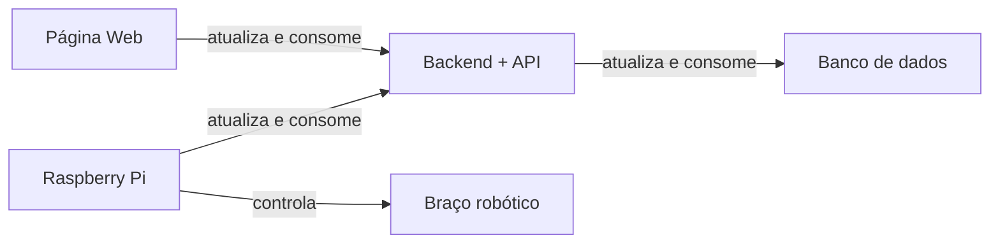

# Arquitetura do sistema

Baseando nos requisitos levantados, a solução terá 5 principais partes, que se integram com o objetivo de entregar a melhor experiência para o usuário.

## Página Web:

Cumpre os requisitos funcionais RF01, RF03, RF04 e RF05, permitindo o armazenamento, edição e registro de itens nos kits, bem como a interação com o backend por meio de requisições.

## Backend com API:
Atende aos requisitos funcionais RF01, RF02, RF03, RF04 e RF05, possibilitando o armazenamento, edição, registro e recuperação de informações sobre os kits, além de enviar comandos para o braço robótico e consultar o banco de dados. É o cérebro de toda a operação.

## Braço Robótico:
Cumpre os requisitos funcionais RF06 e RF07, sendo capaz de montar os kits selecionados e pegar diferentes tipos de itens para a montagem.

## Banco de Dados:
Permite atender aos requisitos funcionais RF02 e RF05, armazenando as informações sobre os kits e os itens utilizados na montagem.

## Raspberry Pi:
Integra o sistema, permitindo a comunicação e o controle do braço robótico.

